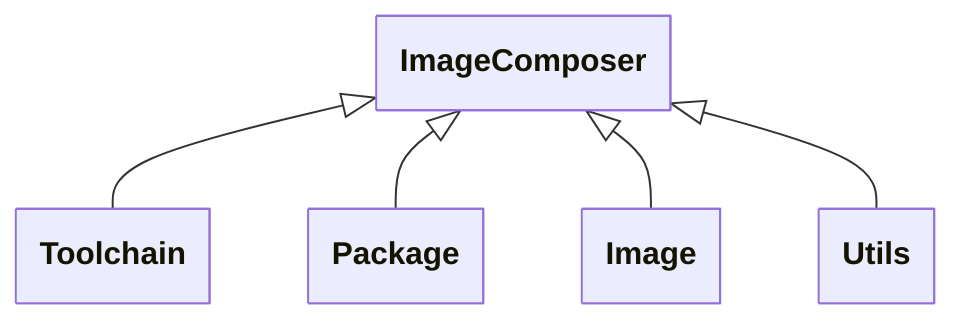
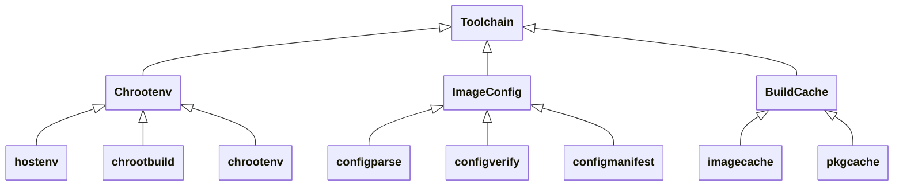
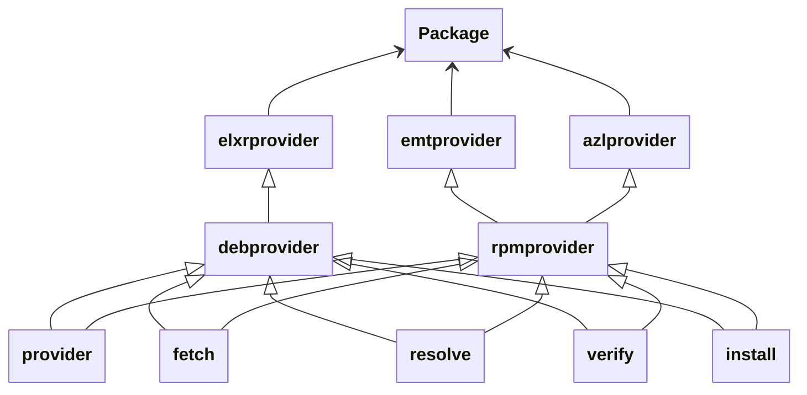
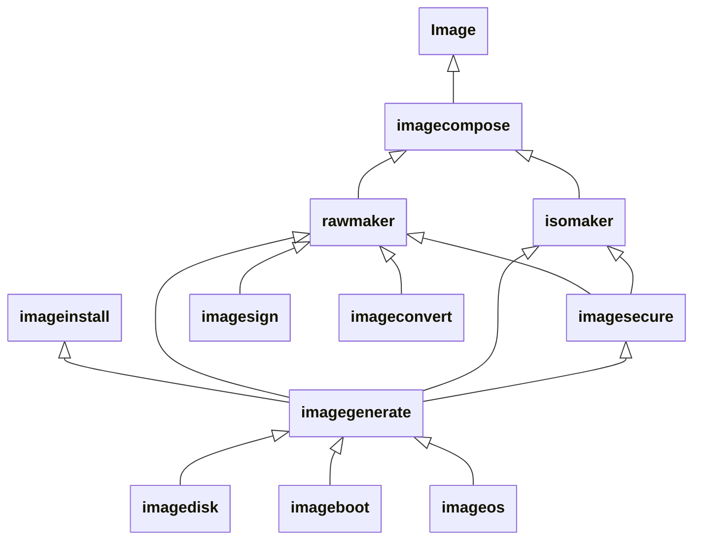

# Image Composer Architecture

## Introduction

The image composer is intended to be a generic toolkit to build operating system
images from pre-built artifacts such as `rpm`, `deb` supporting a range of
common OS for the distributed edge. You can customize the content of the OS to
suit your specific needs based on the type of application and workloads. The
image composer will first be targeting to support:

1. Edge Microvisor Toolkit (EMT) 3.0
1. AzureLinux 3.0
1. WindRiver eLxr

## Architecture Overview

The following diagram shows the input & output of the image compose tools: 

The image composer generates the desired image based on a user customize YAML input which defines what the customizations required target to a supported os distribution. Multiple OS supported by the correspond config files. And a set of default image config files per os distribution helps users get rid of being trapped in the details of os system configurations. The user input YAML file can be simply nothing configured or fill of full detailed configurations. During the image generation, the final config json file is based on the default json config and updated according to the user YAML.

The pre-built artifacts such as `rpm`, `deb`, those packages are from the correspond target os remote repository. Image compose tool implemented the common abstracted package provider interface to fetch packages and solve dependencies from those remote package repository.

For the runtime storage, it includes the chroot env (the rootfs entry for the target os) which is the image generate workspace, the package caches and the image caches as well as the runtime configuration files and logs.

The supported output image type can be various, mainly the raw images nad ISO images, those cover bare metal and VM deployments.

## Image Composer Tool System Network Context

Image Composer Tool network context is shown in the following diagram.

.

 The diagram illustrates how different components of the product's system architecture communicate with each other. This type of diagram is useful for technical documentation, infrastructure planning, security review and troubleshooting.

### Network Security Considerations
Image Composer Tool downloads required packages using HTTP requests to the distribution specific package repos over TLS 1.2+ connections. Each of the package repos does server side validation on the package download requests. So it is expected that the system running the image composer tool is provisioned with a CA root chain.

### Package Sign Verification
All the downloaded packages are integrity verified during download using GPG Public Keys and SHA256/MD5 checksum published at the package repos.

## Components Overview

The following diagram outlines the high level components breakdown of the
image composer: 

The image compose tools can be divide into 3 groups generally, the toolchain, package and the image group, in each group there has a set of the components for the modularized functionalities. The toolchain libraries is about build and setup the image build workspace. The package libraries include the package providers for each supported OSes. And the image libraries provides the general functions to build OS images.

### Toolchain

The host system should be running a validated and supported Linux distribution
such as Ubuntu 24.04. The image-composer implements all of the common business
logic which remains the same regardless of which distribution you are building
an image for. Providers exists for the supported Operating Systems with a
interface definition that each provider needs to implement to decouple
distribution specific functionality from the core and common business logic.

The image composer generates a `chroot` environment which is used for
the image composition and creation process which is isolated from the host
operating file system. Packages are fetched, with help from a provider, and
cached locally before the image is being created.

| SW Component | Description |
| -------- | ------- |
|hostenv|Detect host os info, install tool dependencies.|
|chrootbuild|Build the chrootenv tarball for the target os.|
|chrootenv|Setup chrootenv and initial local package cache for the target os.|
|configparse|Parse and verify the target os then generate the full json config for image.|
|configverify|validate the full json config with json schema.|
|configmanifest|Generate manifest file for the target image.|
|imagecache|Build output image cache handling.|
|pkgcache|pre-fetch packages cache handling.|

### Package

Package is the libraries that provide the unified interface of the OSVs' remote package repositories. By a given package list, it is able to analysis the dependencies of the packages and download all the packages and the dependencies from the target os's remote package repository to a local cache.
During the package downloading, it should also verify the signature of the packages, make sure we get the authenticated packages from the certificated repository. It should also provide the unified interface to install the packages and the dependencies with the correct order into the image rootfs directory.

| SW Component | Description |
| -------- | ------- |
|elxrprovider|Package provider specific for WindRiver elxr.|
|emtprovider|Package provider specific for Edge Microvisor Toolkit.|
|azlprovider|Package provider specific for Azure Linux.|
|debprovider|Generic package provider for debian package repository.|
|rpmprovider|Generic package provider for RPM package repository.|
|provider|Package provider abstract libraries, define the functions|
|resolve|Package provider dependency solving library.|
|fetch|Package provider pkg downloading library.|
|verify|Package provider repo & pkg signature verify library.|
|install|Package provider pkg installation library.|

### Image

Image is the libraries that do the image generation work, those components are divided according to the generic processing flow. It provides the functionality of by given a image configuration JSON file, create and configure the required raw and ISO images.

| SW Component | Description |
| -------- | ------- |
|imagecompose|The top level library which analysis the CLI input params and then call specific functions from the underline libraries.|
|rawmaker|library to generate the RAW image.|
|isomaker|library to generate the ISO image.|
|imagegenerate|Core library for the image generation.|
|imagesecure|Core library for the image immutability configurations.|
|imagesign|library for the image signing.|
|imageconvert|library for the raw image converting.|
|imageinstall|Execution binary for the os installation within the ISO installer image.|
|imagedisk|library for the disk partition creation and file system formatting.|
|imageboot|library for the bootloader configurations.|
|imageos|library for the general os system configurations.|

### Utils
The image composer and its providers use several common `packages` across such
as logging. Those internal libraries are used by the toolchain, package and image libraries.

## Operational Flow

The following flow illustrates the overall image composition flow.

```mermaid
flowchart TD
    s@{ shape: stadium, label: "start" }
    s --> A
    A[User YAML Input Configuration] --> B[Input Validation & Identify Target OS]
    B --> C[Generate target image full JSON config & JSON Schema validation]
    C --> D[Package provider get target os remote repo metadata]
    D --> E[Package provider fetches image packages and dependencies]
    F@{ shape: diamond, label: "if chrootenv pre-build tarball exist" }
    E --> F
    F -- N --> G[Package provider fetches chrootenv packages and dependencies]
    G --> H[Build a chrootenv tarball for the target os]
    H --> I[Setup the chrootenv and initial local caches for image packages]
    F -- Y --> I
    I --> J[Create empty image file and attach to the loop device]
    J --> K[Create partitions and format the partition file system]
    K --> L[Mount partitions to the chrootenv and install images packages]
    L --> M[General system configs, bootloader, user account, hostname, etc.]
    M --> N[Security related configurations, selinux, uki, immutability, etc. optional]
    N --> O[Signing related operations. optional]
    O --> P[Convert raw images to other required formats, vhd, vhdx, qcow2, etc.]
    P --> Q[Generate image manifest file, SBOM, etc.]
    Q --> R[Image cache operation. optional]
    e@{ shape: stadium, label: "end" }
    R --> e
```

